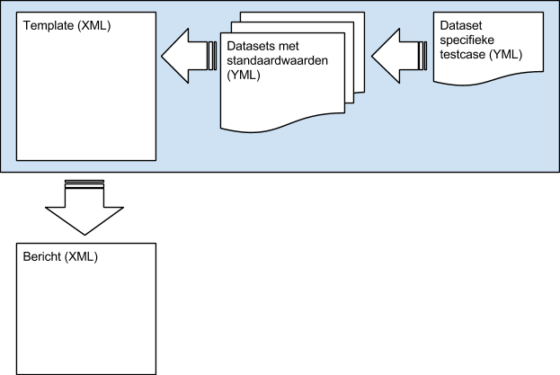

== Tests uitvoeren
Om een test te kunnen uitvoeren met de FunqMachinator moeten een aantal stappen worden uitgevoerd. Een scenario opstellen dat het test geval beschrijft. Indien nodig een beschrijving van één of meer berichten dat verstuurd moet worden en data die in het bericht moet worden ingevuld. Scenario's worden uitgevoerd door een JUnit test.

=== JBehave scenario
De beschrijving van een scenario bevat meerdere steps. Deze worden door de tool vertaald naar Groovy code. Een overzicht van de mogelijke steps staat in het hoofdstuk link:#steps_in_scenario_s[Steps in Scenario's].

[source,gherkin]
.synchronisatie.story
----
Scenario: Synchronisatie Persoon succesvol
Meta:
@status Klaar

Given de database is gereset voor de personen 340014155 <1>
And verzoek van type geefSynchronisatiePersoon
And testdata uit bestand verzoek_synchronisatie_persoon_tc01.yml
When het bericht wordt verstuurd <2>
Then is er 1 bericht geleverd <3>
When vulbericht voor abonnement 'Geen bep. levering doelbinding' wordt bekeken
Then hebben de attributen in de groepen de volgende waardes:
| groep         | attribuut         | verwachteWaardes    |
| nationaliteit | nationaliteitCode | 0001,0001,0001,0027 |
----
<1> Reset een persoon in de database
<2> Versturen van een SOAP bericht
<3> Asynchrone berichten ontvangen

=== Berichten

==== Opzet
In de FunqMachine maken we gebruik van een speciaal opgezet mechanisme om BRP berichten op te stellen. Deze opzet heeft de volgende voordelen:

* Code wordt zo min mogelijk gedupliceerd
* Berichten kunnen flexibel worden opgesteld
* De uiteindelijke testcases worden zo klein mogelijk, zodat de specifieke testdata direct zichtbaar is

Dit mechanisme vereist wel een nauwgezette aanpak voor de opzet van de basis bestanden. De basis bestanden bestaan uit twee basistypen:

Templates in XML voor de berichten:: deze bevatten de volledige maximale structuur van bericht met daarin "placeholders" voor dynamisch in te vullen elementen, attributen en waarden. Voor ieder type bericht is er een eigen template.
Datasets in http://yaml.org[YAML] voor de inhoud van de berichten::
Dit bestaat uit een set van van data dat via inspringing en andere YML syntax ervoor zorgt dat we de templates kunnen vullen. Voor ieder bericht kunnen 1 of meerdere datasets gebruikt worden, in de meeste gevallen zijn dit meerdere datasets die over elkaar heen worden gelegd. Eerst komen de datasets met standaard-waarden voor delen van het bericht en als laatste wordt de dataset voor de specifieke testcase ingevoegd.

.Het stapelen van XML en YML bestanden

==== Berichten maken
Voor de meeste testcases worden webservices benaderd via berichten. Deze berichten dienen flexibel te zijn aangezien we de testdata heel gevarieerd willen kunnen inzetten. Om een wildgroei met dubbele code te vermijden is er daarom gekozen voor een strategie met standaardwaarden met verschillende niveaus.

===== Hoofdlijnen
In hoofdlijnen komt het er op neer dat we een template XML hebben die de kapstok vormt voor het bericht. Om alle mogelijke varianten toe te staan wordt hiervoor het "maximale" bericht gebruikt. Vervolgens schakelen we alle elementen uit, zodat we eigenlijk tijdelijk een leeg bericht overhouden. De volgende stap is het inschakelen van de relevante delen en tot slot wordt testcase-specifieke data in het bericht geschoven. Dit resulteert in een testcase-specifiek bericht. Om het proces achter de schermen helder te krijgen werken we hieronder voorbeelden uit. De opzet van de berichten wordt stapsgewijs uitgelegd.

===== Bijhouding
Een bijhoudingbericht kun je maken via de volgende stap:

....
Given administratieve handeling van type verkrijgingVreemdeNationaliteit , met de acties registratieNationaliteitNaam
....

. De XML template voor het bericht waarin de administratieve handeling staat wordt gezocht. (wordt achter de schermen afgeleid van de administratieve handeling naam)
. Er wordt een YML bestand tegen de template aangehouden die het hele bericht "leeg" maakt, d.w.z. klaar om erna gevuld te gaan worden. (wordt achter de schermen afgeleid van de administratieve handeling naam)
. Een YML bestand met standaard-waarden voor de administratieve handeling wordt ingevoegd. (wordt achter de schermen afgeleid van de administratieve handeling naam)
. Een YML bestand met standaard-waarden voor de actie binnen de administratieve handeling wordt ingevoegd. (wordt achter de schermen afgeleid van de actie naam/namen)

Via een andere stap kan afgeweken worden van de standaardwaarden die zojuist zijn ingevoegd:

....
Given testdata uit bestand verkrijging_vreemde_nationaliteit_testcase_01.yml
....

[start=5]
. De YML bestand die in de stap aangewezen wordt met specifieke testcase-waarden wordt ingevoegd op het eerder samengestelde bericht.

Om bovenstaande mogelijk te maken, dienen de bestanden consistente bestandsnamen te hebben en in de juiste directories te staan.

===== Bevraging/synchronisatie
Een bevraging- of synchronisatiebericht kun je maken via de volgende stappen:

....
Given verzoek van type geefSynchronisatiePersoon
....

....
Given bericht van type lvg_synGeefSynchronisatiePersoon
....

. De XML template voor het type bericht wordt gezocht. (het type dat opgegeven is het type bericht)
. Er wordt een YML bestand tegen de template aangehouden die het hele bericht "leeg" maakt, d.w.z. klaar om erna gevuld te gaan worden. (wordt achter de schermen afgeleid van de type bericht)
. Een YML bestand met standaard-waarden voor de administratieve handeling wordt ingevoegd. (wordt achter de schermen afgeleid van de type bericht)

Via een andere stap kan afgeweken worden van de standaardwaarden die zojuist zijn ingevoegd:

....
Given testdata uit bestand geef_details_persoon_testcase_01.yml
....

[start=4]
. De YML bestand die in de stap aangewezen wordt met specifieke testcase-waarden wordt ingevoegd op het eerder samengestelde bericht.

Om bovenstaande mogelijk te maken, dienen de bestanden consistente bestandsnamen te hebben en in de juiste directories te staan.

==== Aandachtspunten
Hier worden aandachtspunten beschreven die van belang zijn wanneer je bezig bent met de technische inhoud van FunqMachine. Ze zijn verdeeld per type bestand:

===== XML
====== Objectsleutel
Er is een speciale functie voor objectsleutels van personen. De BRP werkt namelijk met een versleutelde waarde waarin het BSN en de partijcode zijn verwerkt. Een voorbeeld van de functie:

[source,xml]
----
<brp:persoon
 brp:communicatieID="${indicatie.persoon.communicatieID}"
 brp:objectSleutel="[@objectsleutel var=indicatie.persoon.objectSleutel partij=stuurgegevens.zendendePartij/]"
 brp:objecttype="Persoon">
----
In bovenstaand voorbeeld is te zien dat er een functie wordt aangeroepen voor de `[@objectsleutel /]`. Daarbij wordt een BSN (`indicatie.persoon.objectSleutel`)  en een partijcode (`stuurgegevens.zendendePartij`) uit samengevoegde YML gehaald. Wanneer deze correct zijn gevuld, zal het een valide objectsleutel opleveren.

====== Lijsten
In de XML berichten staan vrijwel altijd lijsten, dit zijn elementen van hetzelfde type die meervoudig voor kunnen komen. Denk hierbij bijvoorbeeld aan `<bron>` en `<gedeblokkeerdeMelding>`.
Deze meervoudig voorkomende objecten 'assignen' we als lijst (list). Een voorbeeld hiervan staat hieronder. Zoals je kunt zien markeren we een specifieke instantie van een gedeblokeerde melding tussen `[#list/]`-tags.

[source,xml]
----
<brp:gedeblokkeerdeMeldingen>
    <!--1 or more repetitions:-->
    [#list plaatsingAfnemerindicatie.gedeblokkeerdeMeldingen as gedeblokkeerdeMelding]
    <brp:gedeblokkeerdeMelding brp:communicatieID="${gedeblokkeerdeMelding.communicatieID}"
                               brp:objecttype="GedeblokkeerdeMelding"
                               brp:referentieID="${gedeblokkeerdeMelding.referentieID}">
        <brp:regelCode>${gedeblokkeerdeMelding.regelCode}</brp:regelCode>
        <!--Optional:-->
        <brp:elementNaam>${gedeblokkeerdeMelding.elementNaam}</brp:elementNaam>
    </brp:gedeblokkeerdeMelding>
    [/#list]
</brp:gedeblokkeerdeMeldingen>
----

====
IMPORTANT: Acties/actie is hierop een uitzondering. Elke actie geven we namelijk een unieke naam, zodat we ze als unieke objecten kunnen benaderen en vullen.
====

===== YML
====== Volgorde
Bij het samenvoegen/overschrijven van de bericht-template (XML) en de YML bestanden is de volgorde van belang. Dit zal veelal afgedwongen worden achter een _step_ waarin je een bericht definieert, maar het is goed om dit concept te begrijpen. Beginnende bij de template gaat elke YML bestand vervolgens waarden toevoegen/overschrijven op het datamodel dat ontstaat. Als je dus in opvolgende YML bestanden meervoudig dezelfde waarde overschrijft, bijvoorbeeld een partijcode, dan zal de waarde van het laatste YML bestand te zien zijn in het uiteindelijke bericht. Dit ondersteunt het principe van standaard-waarden

====== Lijsten
Bij lijsten, die te herkennen zijn aan de `-` notatie, wordt bij het samenvoegen van YAML bestanden de lijst-entry overschreven. Dat wil zeggen dat de hele instantie overschreven wordt in plaats van 'aangevuld en overschreven'-gedrag. Het is dus van belang dat je bij het overschrijven van lijst-entries alle attributen opnieuw vult. `CommunicatieID` die in de onderste template gezet wordt, zul je bijvoorbeeld kwijt raken als je deze niet opneemt in je overschrijvende yml bestand. Deze dien je dus in nogmaals te definiëren in je overschrijvende yml.

==== Hulpmiddelen
Voor het maken van de XML-Template en bericht-YAML is de tool `MaakDefaultYmlVanuitXmlTemplate` beschikbaar bij de testgevallen. Ook is er `DataToTemplateTest` om te bekijken hoe de gestapelde data in de template wordt ingevuld.

==== Samenvatting
Om een bijhoudingbericht te kunnen versturen heeft de FunqMachinator het volgende nodig:

. XML-Template, een freemarker template
. default YAML bestand voor het bericht-template
. default YAML bestand voor de handeling
. default YAML bestand(en) voor de acties
. optioneel YAML bestand voor het testgeval

De YAML bestanden worden 'gestapeld', dus waardes overschrijven elkaar van generiek naar specifiek (bericht -> handeling -> actie(s) -> testgeval), en daarna in de template ingevuld.

### JUnit test
Voor het uitvoeren is er een junit test nodig die aangeeft _welke_ scenario's worden uitgevoerd. Een minimale test ziet er als volgt uit:

[source,groovy]
----
@AcceptanceTest
class BddStoriesTest extends AbstractSpringJBehaveStories {
    @Override
    List<String> metaFilters() {
        ["groovy: status == 'Klaar'"]
    }
}
----
De test filtert scenario's met een specifieke status. Om andere scenario's te selecteren past met het filter aan. Andere mogelijkheden onstaan door het `Overriden` van andere methodes uit `AbstractSpringJBehaveStories`.
